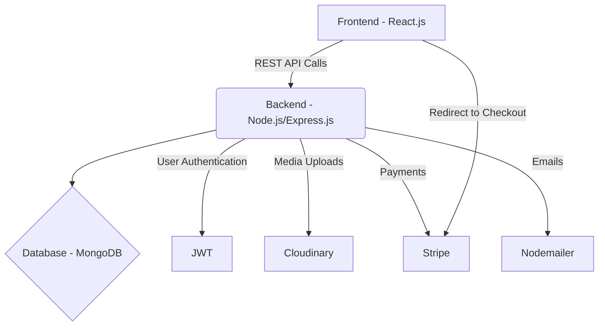

<div align="center">
  <h1>StudyNotion - An Online Learning Platform</h1>
  <p>
    <b>A feature-rich, full-stack online learning platform built with the MERN stack (MongoDB, Express.js, React.js, Node.js) and integrated with Stripe for international payments. This project showcases a robust, scalable, and secure architecture for modern web applications.</b>
  </p>
  <br/>
</div>

---

## ✨ Key Features

StudyNotion is designed with distinct roles, each with its own set of powerful features:

### 👨‍🎓 For Students
- **Course Catalog**: Browse and filter a wide range of courses.
- **Secure Payments**: Purchase courses securely using Stripe.
- **Personalized Dashboard**: Track enrolled courses and progress.
- **Interactive Video Player**: Watch lectures and track completion.
- **Profile Management**: Update profile picture and personal details.
- **Course Ratings & Reviews**: Provide feedback on completed courses.

### 👨‍🏫 For Instructors
- **Course Creation Suite**: A multi-step interface to create and publish courses.
- **Instructor Dashboard**: Get insights into created courses, total students, and income.
- **Content Management**: Add and organize course content with sections and lectures.
- **Media Uploads**: Seamlessly upload course thumbnails and video lectures to Cloudinary.
- **Edit & Manage Courses**: Easily update course details and content.

### ⚙️ Platform Features
- **Role-Based Authentication**: Separate, secure flows for Students and Instructors.
- **JWT-Powered Security**: Secure user authentication and authorization.
- **OTP Verification**: Email-based verification for new sign-ups.
- **Cloud-Based Media**: All media is hosted on Cloudinary for performance and scalability.
- **Responsive Design**: A seamless experience across desktop, tablet, and mobile devices.

---

## 🛠️ Tech Stack

This project is built with modern technologies to ensure performance, scalability, and a great developer experience.

### **Frontend**
- **React.js**: For building the dynamic user interface.
- **Redux Toolkit**: For robust and predictable state management.
- **Tailwind CSS**: For modern, utility-first styling.
- **React Router v6**: For client-side routing.
- **Stripe.js**: For secure payment processing.
- **Axios**: For making API requests.

### **Backend**
- **Node.js & Express.js**: For building the powerful RESTful API.
- **MongoDB**: As the primary NoSQL database.
- **Mongoose**: As the ODM for interacting with MongoDB.
- **Stripe API**: For handling server-side payment logic.
- **Cloudinary**: For cloud-based image and video storage.
- **Nodemailer**: For sending automated emails (OTP, welcome, etc.).
- **JWT & bcrypt**: For secure authentication and password hashing.

---

## 🏗️ System Architecture

The application is designed with a classic client-server architecture, with clear separation of concerns.



---

## 📸 Screenshots

*(Here you can add screenshots of your application. For example:)*

| Home Page                                     | Course Page                                    | Dashboard                                     |
| --------------------------------------------- | ---------------------------------------------- | --------------------------------------------- |
|  |  |  |

---

## 🚀 Getting Started

Follow these instructions to set up and run the project locally.

### Prerequisites

- [Node.js](https://nodejs.org/) (v18 or later recommended)
- [MongoDB](https://www.mongodb.com/) (local instance or a free Atlas account)
- [Stripe CLI](https://stripe.com/docs/stripe-cli) (for testing webhooks)

### Local Setup

1.  **Clone the repository:**
    ```sh
    git clone https://github.com/your-username/studynotion.git
    cd studynotion
    ```

2.  **Install Frontend Dependencies:**
    ```sh
    npm install
    ```

3.  **Install Backend Dependencies:**
    ```sh
    cd server
    npm install
    cd ..
    ```

4.  **Set Up Environment Variables:**
    - Create a `.env` file in the root directory for the frontend.
    - Create a `.env` file in the `/server` directory for the backend.

5.  **Run the Application:**
    The most convenient way to run both the frontend and backend servers concurrently is from the root directory:
    ```sh
    npm run dev
    ```

6.  **Set Up Stripe Webhook (for testing payments):**
    To test the full payment and enrollment flow, you need to forward webhook events to your local server.
    - Log in to the Stripe CLI: `stripe login`
    - Run the listen command:
      ```sh
      stripe listen --forward-to localhost:4000/api/v1/payment/verifyPayment
      ```
    - This will provide you with the `STRIPE_WEBHOOK_SECRET` to add to your `server/.env` file.

---

## 📞 Contact

Harsh Avichal  
**GitHub**: [@harshavichal](https://github.com/harshavichal)  
**LinkedIn**: [Harsh Avichal](https://www.linkedin.com/in/harshavichal0614/)

<div align="center">
  <p>Thank you for checking out StudyNotion!</p>
</div>
